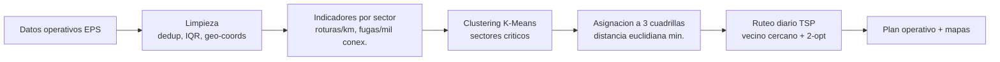

# Datathon SUNASS 2026 — Reto Operacional (Finalista Nacional)

Solución de ciencia de datos para optimizar la operación de una EPS de saneamiento con +300,000 conexiones activas: de la limpieza de datos a la priorización de sectores críticos y la optimización de rutas de reparación.

## Contexto

Una EPS gestiona miles de fugas y roturas al mes con cuadrillas limitadas. Sin priorización basada en datos ni ruteo eficiente, aumentan el agua no facturada, los tiempos de reparación y los costos operativos.

## Arquitectura



## Estructura del proyecto

```
datathon-sunass-2026/
├── src/
│   ├── limpieza.py                             # Normalizacion, geo-coords, timestamps
│   └── ruteo.py                                # Asignacion de cuadrillas + TSP (NN + 2-opt)
├── tests/
│   ├── test_limpieza.py
│   └── test_ruteo.py
├── solucion_lima_ SCC07.ipynb                  # Pipeline completo (notebook)
├── presentacion_solucion_lima_ SCC07.pptx      # Presentacion de la solucion
├── Datathon_SUNASS_2026_Reto_Operacional.pdf   # Enunciado del reto
├── Dockerfile
├── requirements.txt
├── pyproject.toml
├── Makefile
├── .github/workflows/ci.yml
├── LICENSE
└── README.md
```

## Stack

| Categoría | Herramientas |
|---|---|
| Lenguaje | Python |
| Datos | pandas, NumPy |
| ML / optimización | scikit-learn (K-Means), heurística TSP propia (NN + 2-opt) |
| Geo / visualización | Folium, Matplotlib, Seaborn |
| Calidad | pytest, ruff, GitHub Actions (CI) |
| Entorno | Jupyter Notebook, Docker |

## Ejecución

1. Clona el repositorio: `git clone https://github.com/Alvaro192023/datathon-sunass-2026.git`
2. Instala dependencias: `pip install -r requirements.txt`
3. Ejecuta los tests: `pytest -q`
4. Abre `solucion_lima_ SCC07.ipynb` en Jupyter (los módulos reutilizables están en `src/`).

## Resultados e impacto

- **Finalista Nacional** de la Datathon SUNASS 2026.
- Limpieza robusta: deduplicación, estandarización de sectores, corrección de outliers (IQR) y de coordenadas geográficas invertidas.
- Indicadores operativos por sector (roturas/km, fugas/mil conexiones, tiempos de reparación) y **clustering K-Means** para priorizar sectores críticos.
- **Asignación óptima** de fugas a 3 cuadrillas por distancia euclidiana mínima y **ruteo diario con TSP** (vecino más cercano + 2-opt) para minimizar desplazamiento y costo.

## Próximos pasos

- Ruteo con ventanas de tiempo (VRPTW) y capacidad por cuadrilla.
- Modelo predictivo de aparición de fugas por sector.
- Dashboard operativo para el despacho diario de cuadrillas.

## Licencia y contacto

MIT. Álvaro Villanueva Kobayashi — alvarovillakoba515@gmail.com · [GitHub](https://github.com/Alvaro192023)
